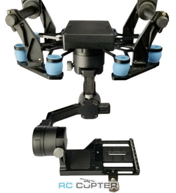
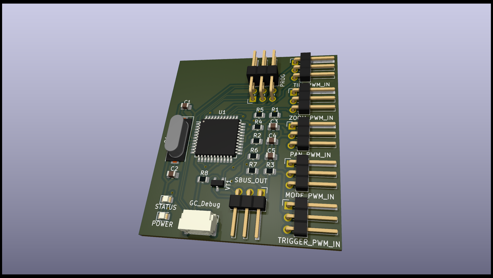

# Tarot TL3W01 360 degrees Three-axis adjustable stabilizing gimbal controller

## Problem description:

1. Device has only SBUS input

2. Original TL3W01 firmware will rotate camera until SBUS channel value returned to neutral. No updates provided from manufacturer. No one email message answered. OK here we go now.

## Solution

Hardware device with ATMEGA 644A chip, which converting 5 PWM inputs to single SBUS output. Additionally, it reads feedback from gimbal debug output and keeps camera direction constant relative to ground, according to PWM value (behavior could be customized).

PCB source is KiCAD 8.0 project.

